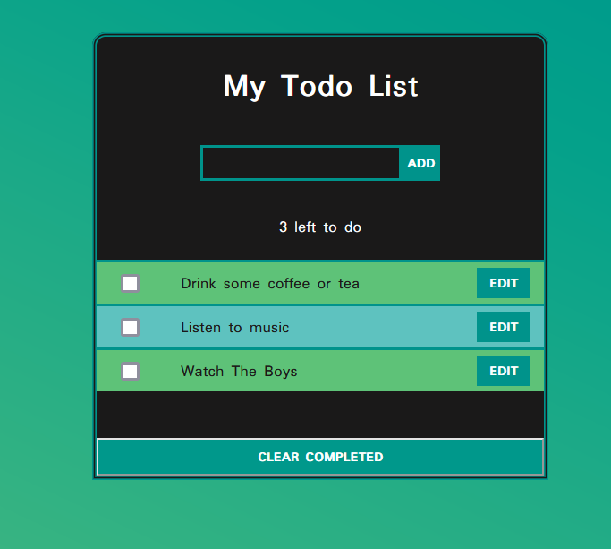

# Getting Started with Create React App

## Introduction

Build a TodoList app to learn how to use React JS.

## Functionalities

- Add new todos
- Mark todos as done or undone
- Clear completed todos
- keep todos saved in your browser
- Knows how many todos are left to do

## Technologies

JS, React, SASS
